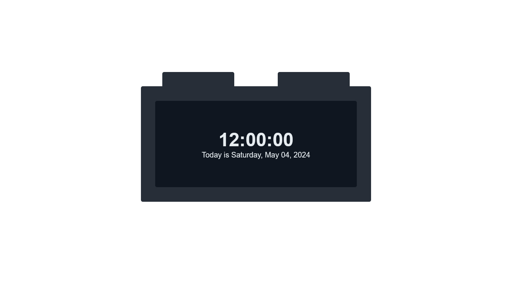

# Real-Time Clock

This is a simple real-time clock using JavaScript

## Table of contents

- [Overview](#overview)
  - [Screenshot](#screenshot)
  - [Links](#links)
  - [Built with](#built-with)
- [Author](#author)

## Overview
  
### Screenshot

### Links

- [GitHub Repository](https://github.com/nanikore0/real-time-clock-js)
- [Live site URL](https://nanikore0.github.io/real-time-clock-js/)

### Built with

- HTML5
- CSS3
- JavaScript

## Author

- GitHub - [nanikore](https://github.com/nanikore0)